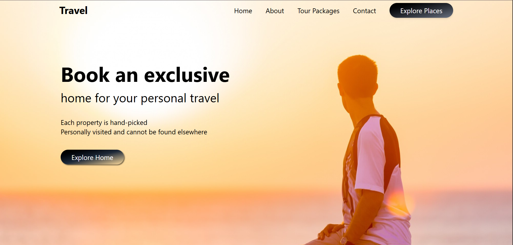
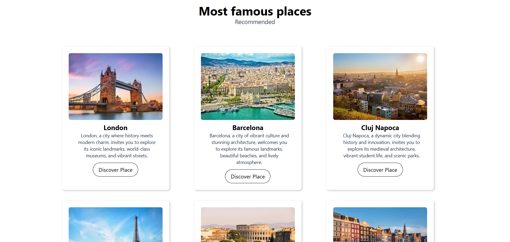

# Travel Website

A modern, responsive travel website built using **React** and **Tailwind CSS**. This frontend-only project showcases beautiful travel destinations, promotes tour packages, and is designed with a focus on user experience and performance.

---

## Features

- 🎨 Clean and modern UI with Tailwind CSS
- 🧭 Interactive navigation and smooth scrolling
- 🖼️ Image galleries and destination highlights
- 📦 Component-based architecture using React

---

## Tech Stack

| Tech           | Description                         |
|----------------|-------------------------------------|
| React          | JavaScript library for UI building  |
| Tailwind CSS   | Utility-first CSS framework         |
| Vite / CRA     | Build tool (based on your setup)    |
| Icons          | Icons for visual elements           |

---

## Getting Started

### 1. Clone the repository

git clone https://github.com/Shruti2026/Travel-Website.git
cd travel-website

### 2. Install dependencies
npm install

### 3. Start development server
npm run dev # or npm start if using CRA

## Screenshots

  

## Author
Shruti Gupta
📧 gshruti779@gmail.com